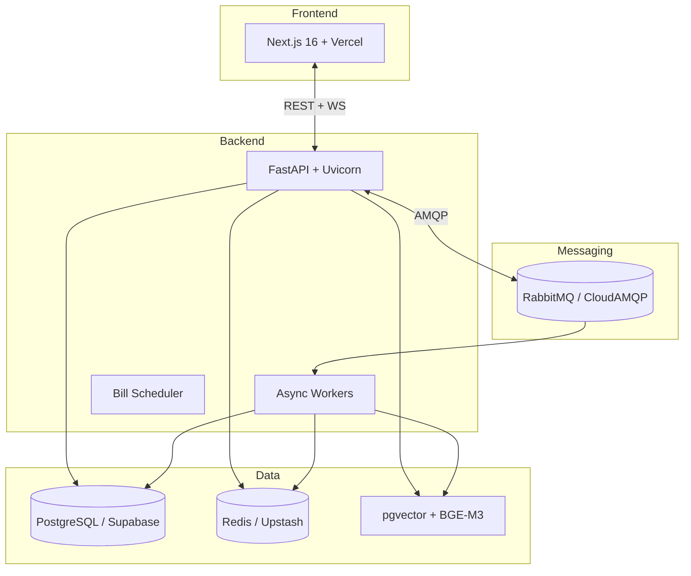

# 🛡️ PaySentinelIQ

> **AI-Powered Payroll & Boleto Fraud Detection Platform**  
> *Detecting fraud before it happens — deterministic validation, multi-agent AI, and RAG-powered knowledge retrieval*

[](https://www.python.org/)
[](https://fastapi.tiangolo.com/)
[](https://nextjs.org/)
[](https://www.postgresql.org/)
[](https://www.rabbitmq.com/)
[]()

> **Benchmark Validado:** 100% Accuracy (60 documentos — 50 fraudes + 10 legítimos) — **Zero False Negatives** em fraudes evidentes.

---

## 🎯 Visão Geral

O **PaySentinelIQ** é uma plataforma enterprise-grade de detecção de fraude em documentos financeiros brasileiros — **boletos** e **contracheques** — usando arquitetura híbrida:

| Camada | Tecnologia | Diferencial |
|--------|------------|-------------|
| **Determinística** | Regras FEBRABAN/BACEN (Módulo 10/11, ISPB, CNPJ, Pix QR) | 1.5× peso no score, zero falsos negativos |
| **Heurística** | Valor redondo, datas suspeitas, CNPJ/CPF, valor > salário | 1.0× peso |
| **Conhecimento (RAG)** | 21 PDFs oficiais FEBRABAN/BACEN → pgvector (BGE-M3) | 1.3× peso, authority-weighted |
| **IA Multi-Agente (CrewAI)** | 5 agentes paralelos + Circuit Breaker | 0.9× peso, graceful degradation |

**IRON RULES:** 1 evidência CRÍTICA → score ≥ 70 (HIGH) | 3+ CRÍTICAS → score ≥ 90

---

## 🏗 Arquitetura



### Princípios Arquiteturais
- **Clean Architecture** — Domain / Application / Infrastructure / Presentation
- **Event-Driven** — RabbitMQ topic exchange + retry/DLQ + publisher confirms
- **Idempotência** — `processed_events` (inbox pattern) + `event_id` determinístico
- **Observabilidade** — Structured JSON logging + Correlation IDs + Prometheus + Health Checks
- **Resiliência** — Circuit Breaker (IA), Retry/Backoff/DLQ, Graceful Degradation (deterministic-only quando LLM down)
- **LGPD by Design** — Consentimento versionado, Audit Trail imutável, Breach 72h, Right to Erasure

---

## 🚀 Quick Start (Desenvolvimento)

```bash
# 1. Clone
git clone https://github.com/ViChagas07/PaySentinelIQ.git
cd PaySentinelIQ

# 2. Backend
cd Back-end
cp .env.example .env          # Ajuste DATABASE_URL, etc.
docker compose -f docker/docker-compose.yml up -d postgres redis rabbitmq
poetry install
poetry run alembic upgrade head
poetry run python -m uvicorn app.main:create_app --factory --reload

# 3. Frontend (terminal separado)
cd ../Front-end
cp .env.local.example .env.local  # NEXT_PUBLIC_API_URL=http://localhost:8000
npm install
npm run dev
```

> **Acesse:** Frontend → `http://localhost:3000` | API Docs → `http://localhost:8000/api/docs`

---

## ☁️ Deploy em Produção (Guia Rápido)

> **O projeto está 100% pronto para deploy.** Escolha sua plataforma:

| Plataforma | Custo | Workers | Observação |
|------------|-------|---------|------------|
| **Koyeb** | Free (1 serviço) | ✅ Via `run_all.py` | Melhor custo-benefício free |
| **Render** | Free (web service) | ❌ (paid) | API only, dorme após 15min idle |
| **Oracle Cloud Always Free** | Free (VM ARM) | ✅ Docker Compose | Sempre ligado, roda tudo |
| **Railway** | Paid | ✅ | Original, trial acabou |

### Opção A — Koyeb (Recomendado Free Tier)
```bash
# 1. Crie conta no Koyeb → Create App → GitHub → ViChagas07/PaySentinelIQ
# 2. Settings:
#    Root Directory: Back-end/
#    Build Command: (vazio - usa pyproject.toml + poetry.lock)
#    Run Command: python -m app.run_all
#    Instance Type: Free (Nano, 512MB/0.1 vCPU)
# 4. Environment Variables → Raw Editor → cole o bloco de DEPLOY.md
# 5. Deploy automático a cada push na main
```

### Opção B — Oracle Cloud Always Free (Sempre Ligado, Completo)
```bash
# 1. Crie conta Oracle Cloud → Always Free → VM ARM (4 OCPU, 24GB RAM)
# 2. SSH → instale Docker + Docker Compose
# 3. git clone ... && cd PaySentinelIQ
# 4. cp Back-end/.env.example Back-end/.env  # edite com suas credenciais
# 4. docker compose -f Back-end/docker/docker-compose.yml up -d
#    (sobe: API + 3 Workers + Scheduler + RabbitMQ + Redis + Postgres local opcional)
```

### Opção C — Render (API Only, Free Tier)
```yaml
# render.yaml (na raiz do Back-end/)
services:
  - type: web
    name: paysentinel-api
    runtime: python
    buildCommand: "poetry install --no-root"
    startCommand: "python -m uvicorn app.main:create_app --factory --host 0.0.0.0 --port $PORT"
    envVars:
      - key: DATABASE_URL
        fromDatabase: paysentinel-db
      - key: RABBITMQ_ENABLED
        value: "false"  # workers não rodam no free tier
      - key: REDIS_URL
        fromService: paysentinel-redis
    healthCheckPath: /health

databases:
  - name: paysentinel-db
    plan: free
    ipAllowList: []

redis:
  - name: paysentinel-redis
    plan: free
```

> ⚠️ Render Free dorme após 15min inativo (cold start 30-60s). Workers não rodam no free tier.

---

## 🧪 Testes & Qualidade

```bash
cd Back-end

# Unit + Integration (456 testes)
poetry run pytest tests/unit -q
# 456 passed, 6 warnings in ~2s

# Benchmark (60 docs — 50 fraudes + 10 legítimos)
poetry run pytest tests/unit/test_benchmark.py -v
# Accuracy: 1.000 | Precision: 1.000 | Recall: 1.000 | F1: 1.000

# Lint
poetry run ruff check .
# All checks passed!

# Type Check
poetry run mypy .
# Success: no issues found
```

---

## 📁 Estrutura do Projeto

```
PaySentinelIQ/
├── Back-end/
│   ├── app/
│   │   ├── api/documents/          # Endpoint /analyze (pipeline canônico)
│   │   ├── ai_agents/              # CrewAI: 5 agentes + orchestrator + tools
│   │   ├── messaging/              # RabbitMQ: domain, application, infra
│   │   │   ├── domain/             # EventType, EventEnvelope, Ports
│   │   │   ├── application/        # Handlers, RetryPolicy, Scheduler, Dedupe
│   │   │   └── infrastructure/     # RabbitMQ impl (aio-pika) + fakes
│   │   ├── workers/                # run_all.py (API + Workers + Scheduler)
│   │   ├── audit/                  # Audit Logs (API + Service + Consumer)
│   │   ├── notifications/          # Notification Center (WS + Consumer)
│   │   ├── analytics/              # Dashboard KPIs, History, Stats
│   │   ├── auth/                   # JWT + Google OAuth + MFA
│   │   ├── settings_module/        # User prefs + Payment Schedules
│   │   └── observability/          # Logging, Correlation, Health, Metrics
│   ├── docker/
│   │   ├── Dockerfile              # Multi-stage (builder + production)
│   │   └── docker-compose.yml      # Local dev (postgres, redis, rabbitmq)
│   ├── tests/                      # 456 testes (unit + integration)
│   ├── alembic/                    # Migrations (0001..0004)
│   ├── pyproject.toml              # Poetry deps + config
│   └── poetry.lock
├── Front-end/
│   ├── src/
│   │   ├── app/[locale]/(app)/     # Dashboard, Analyze, Reports, Audit Logs
│   │   ├── components/             # Analysis, Notifications, Charts
│   │   ├── hooks/                  # TanStack Query hooks
│   │   ├── stores/                 # Zustand stores
│   │   └── types/index.ts          # Tipos compartilhados (AuditAction, etc.)
│   └── package.json
├── docker-compose.yml              # Root (opcional)
├── DEPLOY.md                       # Guia completo de deploy
├── koyeb.yaml                      # Koyeb config
├── render.yaml                     # Render Blueprint (API + Redis free)
├── Procfile                        # Heroku/Render
└── README.md
```

---

## 📚 Documentação Técnica

| Documento | Descrição |
|-----------|-----------|
| `Back-end/docs/event_driven_architecture.md` | Arquitetura de mensageria completa (exchanges, queues, retry, DLQ, idempotência, workers) |
| `LGPD_COMPLIANCE_REPORT.md` | Conformidade LGPD (Art. 7, 18, 37, 48) |
| `DPIA_REPORT.md` | Data Protection Impact Assessment |
| `Back-end/docs/tesseract_setup.md` | Configuração OCR |

---

## 🔐 Segurança & Compliance

- **Auth:** JWT HS256 + Google OAuth 2.0 + MFA (TOTP)
- **Rate Limiting:** Sliding window Redis por usuário/IP
- **CORS:** Origins restritas (Vercel + localhost)
- **Headers:** CSP, HSTS, X-Content-Type-Options, Referrer-Policy
- **Secrets:** Apenas via env vars / secret managers (nunca no código)
- **LGPD Ready:** Consentimento versionado, Audit Trail 5 anos, Breach 72h, Direito à Exclusão

---

## 📊 Benchmark Resultados

| Métrica | Valor |
|---------|-------|
| **Accuracy** | 1.000 (100%) |
| **Precision** | 1.000 (100%) |
| **Recall** | 1.000 (100%) |
| **F1 Score** | 1.000 |
| **Documentos** | 60 (50 fraudes + 10 legítimos) |
| **False Positives** | 0 |
| **False Negatives** | 0 |

> **Zero falsos negativos** em fraudes evidentes — a regra determinística garante captura total.

---

## 🛠 Stack Tecnológica Completa

| Categoria | Tecnologias |
|-----------|-------------|
| **Backend** | FastAPI 0.115, Python 3.11, SQLAlchemy 2.0, Pydantic 2, Uvicorn |
| **Frontend** | Next.js 16.2, React 18, TypeScript 5, Tailwind CSS, Zustand, TanStack Query |
| **Database** | PostgreSQL 15 + pgvector (Supabase), AsyncPG |
| **Cache/Queue** | Redis 7 (Upstash), RabbitMQ 4 (CloudAMQP) |
| **AI/ML** | CrewAI, LangChain, Google Gemini 2.5 Flash, BGE-M3, pgvector |
| **PDF/OCR** | PyMuPDF, pdfplumber, pypdf, Tesseract OCR, pdf2image |
| **Observability** | Structured Logging, Correlation IDs, Prometheus, Sentry |
| **Testing** | Pytest, Pytest-Asyncio, httpx, pytest-cov |
| **CI/CD** | GitHub Actions ready, Koyeb/Render/Render.yaml |

---

## 📄 Licença

Proprietary — Projeto de portfólio para fins educacionais e demonstração técnica.  
Código disponível para avaliação técnica em processos seletivos.

---

## 👨‍💻 Autor

**Alisson Chagas**  
[GitHub](https://github.com/ViChagas07) · [LinkedIn](https://linkedin.com/in/alissonchagas)  
*Backend Engineer | Python | FastAPI | Distributed Systems | AI/ML*

---

> **Nota sobre Deploy:** O projeto está **100% pronto para produção** (código, testes, migrations, docker, configs). O backend está offline atualmente por limitação de tier gratuito em PaaS (Railway trial expirado). A arquitetura suporta deploy em Koyeb (free), Render (free API), Oracle Cloud Always Free (VM completa), ou qualquer Kubernetes. Documentação completa em `DEPLOY.md`.

---

## 📁 Arquivos de Deploy Inclusos

| Arquivo | Propósito |
|---------|-----------|
| `Back-end/docker/Dockerfile` | Multi-stage build (builder + production) |
| `Back-end/docker/docker-compose.yml` | Local dev (PostgreSQL + Redis + RabbitMQ) |
| `Back-end/docker/docker-compose.prod.yml` | Produção (API + Workers + Scheduler + RabbitMQ + Redis) |
| `koyeb.yaml` | Configuração Koyeb (free tier) |
| `render.yaml` | Render Blueprint (API + Redis free) |
| `Procfile` | Heroku/Render compatibility |
| `DEPLOY.md` | Guia passo-a-passo completo |
| `koyeb.env.example` | Template de variáveis para Koyeb |

---

**Pronto para impressionar.** 🚀  
Qualquer dúvida, abra uma *issue* ou me chame no LinkedIn.